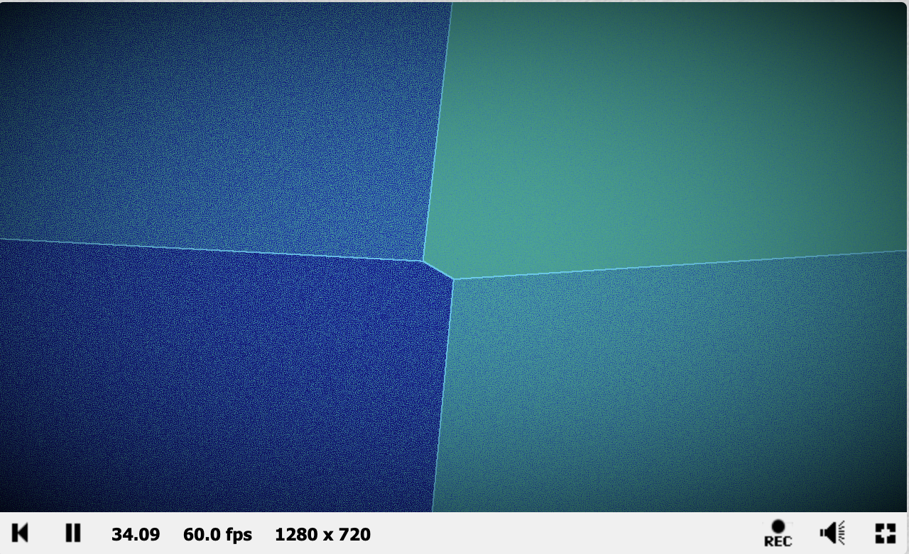
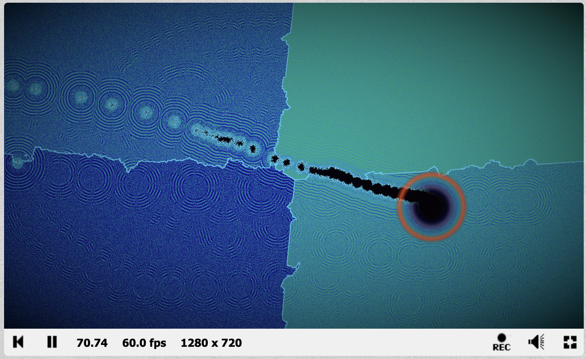
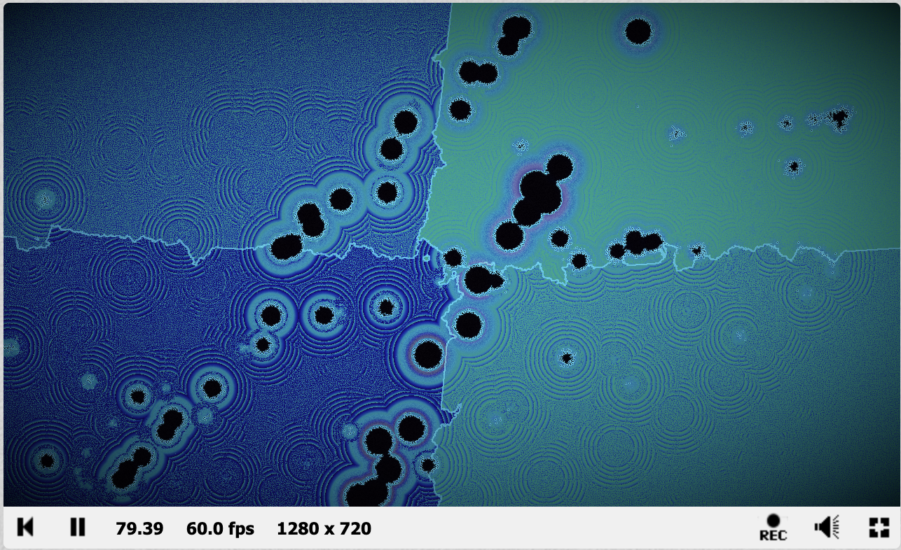
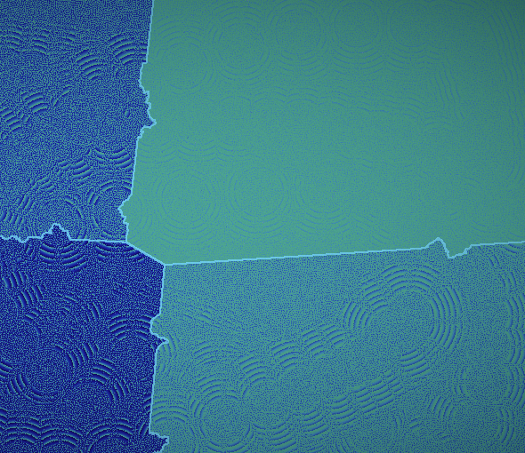

# Cortical Drift: Remapping Sim
### Emergent Simulation of Post-Lesion Cortical Remapping · Real-Time GLSL Shader

*Stable territorial competition between four neural populations — fMRI false-colour rendering*

*Active lesion site with perilesional recolonization and travelling wave fronts*

*Post-lesion remapping — competing populations invade the damaged territory*

*Close up of post-lesion remapping — competing populations invade the damaged territory*

[**View Live on Shadertoy →**](https://www.shadertoy.com/view/NfXXz4)

---

## Overview

Cortical Drift is an emergent simulation of post-stroke cortical remapping — the process by which surviving neural populations compete to recolonize territory damaged by focal cortical injury. The system models four competing neural populations over a shared chemical signalling field, producing both adaptive (perilesional) and maladaptive (vicarious) remapping outcomes from the same underlying local rules.

The biological phenomenon is well documented: after stroke, neighbouring regions do not remain static but actively compete to recolonize damaged territory through axonal sprouting and synaptic reorganization. Whether the correct anatomically adjacent region wins (adaptive) or a distal non-homologous region invades (maladaptive) depends on the competitive dynamics — not on any predetermined outcome. This simulation demonstrates that distinction emergently.

---

## Why This Matters Beyond Visuals

This project sits at the direct intersection of **computational neuroscience, AI safety, and alignment research**.

The central result — that the same local rules produce qualitatively different macroscopic outcomes depending on parameters — is structurally identical to one of the hardest problems in AI alignment: **predicting system-level behavior from component-level rules**. The perilesional/vicarious remapping distinction is an instance of the broader question of when a system recovers adaptively versus when it compensates in ways that appear functional but are structurally wrong.

The three-buffer feedback architecture also demonstrates a key systems engineering principle relevant to AI safety: **no single component controls the outcome**. The remapping regime emerges from the interaction of chemical gradients, wave activity, and territorial arbitration — none of which is sufficient alone. Understanding how coupled subsystems produce emergent global behavior is foundational to both mechanistic interpretability and the study of mesa-optimization in neural networks.

---

## System Architecture

| Buffer | Role |
|--------|------|
| **Buffer A** | Territory & lesion map — stores population ownership and damage per pixel; implements Voronoi initialization, mouse-driven lesion application, probabilistic recolonization guided by Buffers B and C |
| **Buffer B** | Chemical signalling field — four-channel reaction-diffusion system; each channel holds one population's attractant concentration; spatial gradient determines which population wins recolonization |
| **Buffer C** | Excitable medium / wave activity — Hodgepodge machine-inspired three-state system (quiescent, excited, refractory); wave activity feeds back into Buffer A to bias territorial expansion toward more active populations |
| **Image** | fMRI false-colour render — composites all three buffers; population territories as cool blue/violet hues; wave fronts push pixels up the fMRI colour ramp (blue→cyan→green→yellow→red→white); Sobel edge detection highlights territory borders |

The three buffers form a **closed feedback loop**: damage drives chemical emission → chemical gradients guide recolonization → wave activity biases which population wins. No single buffer controls the outcome.

---

## Interaction

- **Mouse click/hold** — introduces a lesion at cursor position (84px radius)
- **Multiple clicks** — each adds a new lesion; watch populations compete for the same vacant territory
- **Reload/restart** — reseeds territory map with fresh random micro-damage

**Recommended:** Let the system run 10–15 seconds before clicking to allow wave dynamics to develop fully.

**Tunable parameters:**

| Parameter | Location | Effect |
|-----------|----------|--------|
| `PLASTICITY_RATE` | Buffer A | Higher = faster recolonization |
| `LESION_RADIUS` | Buffer A | Controls damage zone size |

---

## Key Emergent Results

**Perilesional recovery (adaptive):** The anatomically adjacent population expands into the lesion site, guided by stronger chemical signal proximity. Clinically associated with better functional outcomes.

**Vicarious remapping (maladaptive):** A distal non-homologous population invades the vacancy. Emerges under parameter regimes where wave activity advantages overcome chemical gradient proximity. Clinically associated with incomplete or misleading recovery.

Both outcomes emerge from identical local rules. The transition between them is parameter-dependent and not explicitly programmed — a direct demonstration of emergent phase behavior in a complex adaptive system.

---

## Technical Notes

The system is a qualitative rather than quantitative model. It does not simulate individual neurons or precise synaptic geometry. Its value lies in demonstrating that the clinically observed distinction between adaptive and maladaptive remapping can emerge from a small set of local competitive rules — consistent with neural field theory arguments that macroscopic cortical dynamics arise from local excitatory and inhibitory interactions (Ermentrout & Cowan, 1979) and that experience-dependent plasticity is governed by activity-dependent competition between populations (Buonomano & Merzenich, 1998).

---

## Academic References

Buonomano, D. V., & Merzenich, M. M. (1998). Cortical plasticity: From synapses to maps. *Annual Review of Neuroscience, 21*, 149–186.

Ermentrout, G. B., & Cowan, J. D. (1979). A mathematical theory of visual hallucination patterns. *Biological Cybernetics, 34*(3), 137–150.

Nudo, R. J., Wise, B. M., SiFuentes, F., & Milliken, G. W. (1996). Neural substrates for the effects of rehabilitative training on motor recovery after ischemic infarct. *Science, 272*(5269), 1791–1794.

Turing, A. M. (1952). The chemical basis of morphogenesis. *Philosophical Transactions of the Royal Society B, 237*(641), 37–72.

Jones, J. (2010). Characteristics of pattern formation and evolution in approximations of Physarum transport networks. *Artificial Life, 16*(2), 127–153.

---

## Future Extensions

- Inhibitory surround field modelling GABAergic suppression of vicarious regions
- Spreading cortical depolarisation wave following lesion, modelling secondary damage observed clinically after stroke
- User-controlled therapy brush that boosts perilesional activity — interactive exploration of rehabilitation interventions
- True refractory period timer per pixel for more realistic Hodgkin-Huxley-like oscillatory dynamics

---

## Stack
`GLSL` `Shadertoy` `Reaction-Diffusion` `Excitable Media` `Voronoi` `Cellular Automata` `Computational Neuroscience` `fMRI Visualization` `Emergent Systems`

---

*Part of an ongoing series of real-time shader simulations exploring emergent behavior in complex adaptive systems. Directly informs ongoing MRP research on AI-assisted neurorehabilitation for stroke survivors at York University.*
